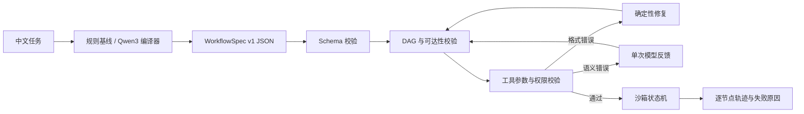

# FlowSpec

> 自然语言工作流编译、校验与小模型微调 · Natural language → validated workflow DAG

[在线沙箱 Demo](https://daizhouchen.github.io/flowspec-sft/) · [30 秒操作视频](docs/assets/demo.webm) · [数据卡](DATA_CARD.md) · [模型卡](MODEL_CARD.md)


FlowSpec 把中文业务描述转换成 `WorkflowSpec v1`，在运行前检查工具、参数、依赖、条件、人工确认、重试与失败路径。系统只在沙箱中模拟状态流转，不连接真实邮箱、企业微信、数据库写入或其他有副作用的系统。

## 为什么做这个项目

Agent 把自然语言直接变成工具调用时，常见失败并非语言不流畅，而是结构不可执行：参数缺失、循环依赖、工具越权或通知前没有确认。FlowSpec 把生成任务改写成“编译问题”，让小模型负责结构生成，让确定性校验器负责执行门禁与有限修复。

## 当前能力

- `WorkflowSpec v1` 支持串行、并行、条件分支、人工确认、重试和失败处理。
- 18 个虚拟工具覆盖检索、分类、转换、报表、审批与通知六类能力。
- 校验 JSON Schema、DAG、未知工具、必填参数、不可达节点和通知权限风险。
- 格式错误允许确定性修复；语义错误最多反馈模型一次，失败后转人工确认。
- 2,200 条合成样本：1,600 train / 250 dev / 250 test / 100 challenge；按模板族切分以避免改写泄漏。
- FastAPI 提供 `/api/compile`、`/api/validate`、`/api/simulate`、`/api/tools`。
- Qwen3-0.6B / 1.7B QLoRA 训练、推理与评测脚本已经就绪。

## 系统架构



## 当前基线

下表是无需 GPU 的启发式编译器结果，**测试集仍待作者逐条人工复核，状态为 provisional**。

| 数据集 | Schema 合法率 | DAG 合法率 | 沙箱通过率 | 工具 F1 | 参数槽位 F1 | 依赖边 F1 |
|---|---:|---:|---:|---:|---:|---:|
| 标准测试集（250） | 1.000 | 1.000 | 1.000 | 0.873 | 0.866 | 0.775 |
| 未见组合挑战集（100） | 1.000 | 1.000 | 1.000 | 0.407 | 0.433 | 0.000 |

挑战集上的明显下降被保留为真实错误分析入口。zero-shot、few-shot、基础模型 + 校验器、QLoRA + 校验器四组模型实验需在共享 GPU 资源门禁通过后运行，仓库不会预填结果。完整基线见 [`reports/heuristic-baseline.json`](reports/heuristic-baseline.json)。

## 一条命令启动

```bash
docker compose up --build
```

打开 `http://localhost:8010`。不使用 Docker 时：

```bash
uv sync --extra dev
uv run python -m flowspec.data --output data/generated
uv run uvicorn flowspec.api:app --port 8010 --reload
```

另一个终端：

```bash
cd web
npm ci
npm run dev
```

## 训练与模型评测

共享服务器先执行只读资源门禁，再串行运行一个任务：

```bash
bash scripts/server_preflight.sh
uv sync --extra train
CUDA_VISIBLE_DEVICES=GPU-e4099e8f-7881-b850-cbc8-a9cfe310809c \
OMP_NUM_THREADS=2 TOKENIZERS_PARALLELISM=false uv run python scripts/train_qlora.py \
  --model Qwen/Qwen3-0.6B \
  --output artifacts/qwen3-0.6b-qlora
```

门禁默认要求主机可用内存不少于 64 GiB、cgroup 余量不少于 32 GiB、磁盘余量不少于 100 GiB，并在 10 秒两次采样中确认目标 GPU 空闲显存不少于 25 GiB且利用率不高于 5%。任一条件不满足时停止，不降低门槛或自动重试。

生成与评测预测：

```bash
uv run python scripts/generate_predictions.py \
  --mode zero-shot --output reports/zero-shot.jsonl
uv run python scripts/generate_predictions.py \
  --mode few-shot --output reports/few-shot.jsonl
uv run python scripts/generate_predictions.py \
  --mode sft --adapter artifacts/qwen3-0.6b-qlora \
  --output reports/sft.jsonl
uv run python scripts/evaluate_predictions.py \
  --gold data/generated/test.jsonl \
  --predictions reports/sft.jsonl \
  --output reports/sft-metrics.json
```

## 测试与人工复核

```bash
uv run pytest -q
uv run ruff check .
uv run python -m flowspec.eval --data data/generated
python scripts/review_dataset.py --split test --reviewer YOUR_NAME
python scripts/review_dataset.py --split challenge --reviewer YOUR_NAME
```

## English summary

FlowSpec compiles Chinese business instructions into a validated workflow DAG. It combines a small language-model compiler with deterministic schema, dependency, tool and permission checks, then executes only inside a side-effect-free simulator. The public demo uses a browser-side fixed compiler and stores no user input.

## License

Apache-2.0.
