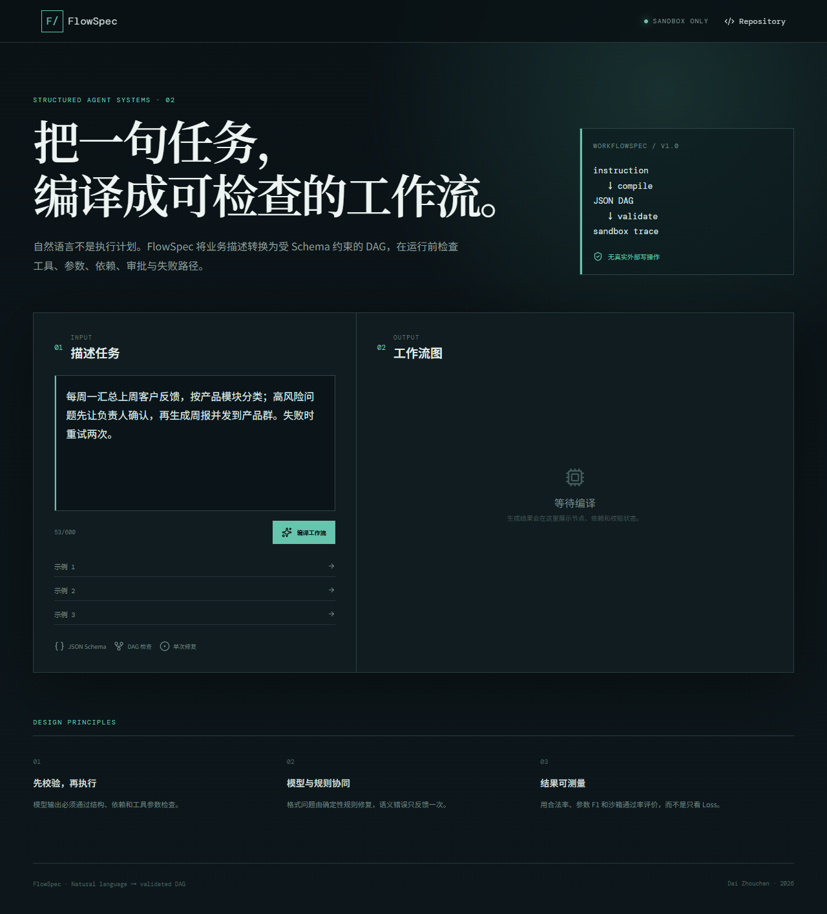
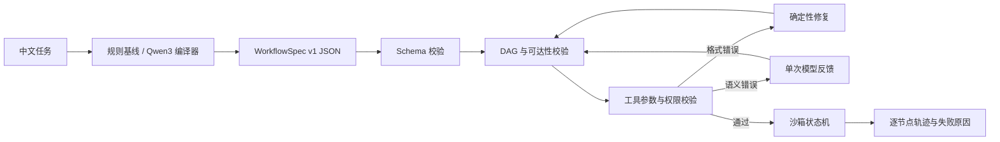

# FlowSpec

> 自然语言工作流编译、校验与小模型微调 · Natural language → validated workflow DAG

[在线沙箱 Demo](https://daizhouchen.github.io/flowspec-sft/) · [30 秒操作视频](docs/assets/demo.webm) · [数据卡](DATA_CARD.md) · [模型卡](MODEL_CARD.md) · [错误分析](docs/error-analysis.md)



FlowSpec 把中文业务描述转换成 `WorkflowSpec v1`，在运行前检查工具、参数、依赖、条件、人工确认、重试与失败路径。系统只在沙箱中模拟状态流转，不连接真实邮箱、企业微信、数据库写入或其他有副作用的系统。

## 为什么做这个项目

Agent 把自然语言直接变成工具调用时，常见失败并非语言不流畅，而是结构不可执行：参数缺失、循环依赖、工具越权或通知前没有确认。FlowSpec 把生成任务改写成“编译问题”，让小模型负责结构生成，让确定性校验器负责执行门禁与有限修复。

## 当前能力

- `WorkflowSpec v1` 支持串行、并行、条件分支、人工确认、重试和失败处理。
- 18 个虚拟工具覆盖检索、分类、转换、报表、审批与通知六类能力。
- 校验 JSON Schema、DAG、未知工具、必填参数、不可达节点和通知权限风险。
- 格式错误允许确定性修复；语义错误最多反馈模型一次，失败后转人工确认。
- 2,200 条合成样本：1,600 train / 250 dev / 250 test / 100 challenge；按模板族切分以避免改写泄漏。
- FastAPI 提供 `/api/compile`、`/api/validate`、`/api/simulate`、`/api/tools`。
- 已完成 Qwen3-1.7B 4-bit QLoRA、四组基线、GGUF Q4_K_M 导出及模型后端联调。

## 系统架构



## 实验结果

Qwen3-1.7B 在 1,600 条训练样本上完成 4-bit QLoRA；标准测试集 250 条，未见工具组合挑战集 100 条。测试集与挑战集仍待作者逐条人工复核，因此数字为 **provisional**，不可视为线上业务效果。

| 方案 | Schema | DAG | 沙箱 | 工具 F1 | 参数 F1 | 依赖边 F1 | 语义结构 |
|---|---:|---:|---:|---:|---:|---:|---:|
| zero-shot | 0.668 | 0.668 | 0.500 | 0.251 | 0.002 | 0.000 | 0.084 |
| few-shot + 校验器 | 0.852 | 0.852 | 0.852 | 0.706 | 0.719 | 0.595 | 0.674 |
| QLoRA + 校验器 | **1.000** | **1.000** | **1.000** | **0.856** | **0.844** | **0.680** | **0.793** |
| QLoRA 挑战集 | **1.000** | **1.000** | **1.000** | **0.818** | **0.801** | 0.376 | **0.665** |

QLoRA 相对 few-shot 的语义结构得分提高 **11.95 个百分点**，沙箱通过率提高 **14.8 个百分点**；四项预设验收门槛全部达到。训练损失 0.0221，验证损失 0.1914，峰值分配显存 4.276 GiB。完整配置、延迟、资源峰值和错误分析见 [`reports/experiment-summary.md`](reports/experiment-summary.md)、[模型卡](MODEL_CARD.md)与[错误分析](docs/error-analysis.md)。

## 一条命令启动

```bash
docker compose up --build
```

打开 `http://localhost:8010`。不使用 Docker 时：

```bash
uv sync --extra dev
uv run python -m flowspec.data --output data/generated
uv run uvicorn flowspec.api:app --port 8010 --reload
```

另一个终端：

```bash
cd web
npm ci
npm run dev
```

## 训练与模型评测

共享服务器先执行只读资源门禁，再串行运行一个任务：

```bash
bash scripts/server_preflight.sh
uv sync --extra train
CUDA_VISIBLE_DEVICES=<SELECTED_GPU_UUID_FROM_PREFLIGHT> \
OMP_NUM_THREADS=2 TOKENIZERS_PARALLELISM=false uv run python scripts/train_qlora.py \
  --model Qwen/Qwen3-0.6B \
  --output /home/jiangjiaqi/zcdai/flowspec-sft/artifacts/qwen3-0.6b-qlora
```

首次部署可先运行 5 步端到端冒烟测试，验证模型下载、4-bit 量化、数据处理、反向传播和 Adapter 保存：

```bash
CUDA_VISIBLE_DEVICES=<SELECTED_GPU_UUID> OMP_NUM_THREADS=2 \
TOKENIZERS_PARALLELISM=false uv run python scripts/train_qlora.py \
  --model Qwen/Qwen3-0.6B \
  --train-limit 64 --dev-limit 16 --max-steps 5 \
  --output /home/jiangjiaqi/zcdai/flowspec-sft/artifacts/qwen3-0.6b-smoke
```

门禁会在当前容器可见的 GPU 中自动选择空闲卡。默认要求 `/home/jiangjiaqi/zcdai` 可用、主机可用内存不少于 64 GiB、cgroup 余量不少于 32 GiB、磁盘余量不少于 100 GiB、1 分钟负载低于可见 CPU 数量的 75%，并在 10 秒两次采样中确认所选 GPU 空闲显存不少于 25 GiB且利用率不高于 5%。任一条件不满足时停止，不降低门槛或自动重试。

生成与评测预测：

```bash
uv run python scripts/generate_predictions.py \
  --mode zero-shot --output reports/zero-shot.jsonl
uv run python scripts/generate_predictions.py \
  --mode few-shot --output reports/few-shot.jsonl
uv run python scripts/generate_predictions.py \
  --mode sft --adapter artifacts/qwen3-0.6b-qlora \
  --output reports/sft.jsonl
uv run python scripts/evaluate_predictions.py \
  --gold data/generated/test.jsonl \
  --predictions reports/sft.jsonl \
  --output reports/sft-metrics.json
```

## 模型推理服务与 CPU 量化

FastAPI 默认使用零依赖启发式编译器，便于直接运行。完成训练后可切换到
Transformers + LoRA Adapter：

```bash
FLOWSPEC_COMPILER=transformers \
FLOWSPEC_MODEL=Qwen/Qwen3-1.7B \
FLOWSPEC_ADAPTER=artifacts/qwen3-1.7b-qlora-diverse \
uv run uvicorn flowspec.api:app --port 8010
```

远程服务器上的 CPU 导出命令会合并 Adapter、转换为 GGUF Q4_K_M，并生成
SHA-256 校验文件；额外转换依赖安装在独立目录中，不会修改训练环境：

```bash
FLOWSPEC_CLEAN_INTERMEDIATE=1 bash scripts/export_gguf.sh
FLOWSPEC_COMPILER=llama_cpp docker compose --profile model up --build
```

模型输出先经过确定性格式修复；若仍有语义校验错误，模型最多接收一次错误反馈。
再次失败时 API 返回 `validation_failed`，不会进入沙箱执行。

最终 Q4_K_M 文件为 1,107,408,736 bytes，SHA-256 为
`cb9ce8cde4b3f733b2c97fa43966517914a841e08a8eaffee303af74962ce0a3`。
远程 CPU 冒烟以 2 线程在 6.37 秒内完成模型加载与单轮回复；随后通过
`llama-server → FastAPI → /api/compile → /api/simulate` 验证，生成的 5 节点工作流
通过 Schema、DAG 与沙箱执行。该端到端样例耗时 70.75 秒，适合作为零成本验证路径，
不代表并发服务性能。验证记录见 [`reports/e2e-verification.json`](reports/e2e-verification.json)。

## 测试与人工复核

```bash
uv run pytest -q
uv run ruff check .
uv run python -m flowspec.eval --data data/generated
python scripts/review_dataset.py --split test --reviewer YOUR_NAME
python scripts/review_dataset.py --split challenge --reviewer YOUR_NAME
```

## English summary

FlowSpec compiles Chinese business instructions into a validated workflow DAG. It combines a small language-model compiler with deterministic schema, dependency, tool and permission checks, then executes only inside a side-effect-free simulator. The public demo uses a browser-side fixed compiler and stores no user input.

## License

Apache-2.0.
