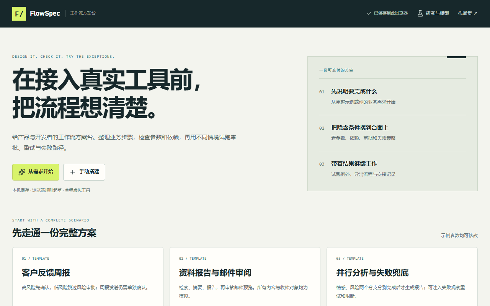
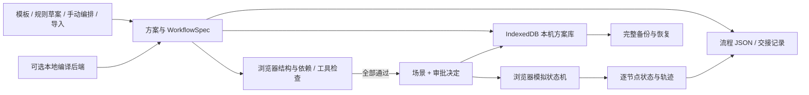

# FlowSpec

> 工作流方案台：起草、检查、沙箱试跑与交接 · Draft, inspect, simulate and hand off workflow plans

[打开工作台](https://daizhouchen.github.io/flowspec-sft/) · [使用说明](docs/product-workbench.md) · [工作台架构](docs/architecture-workbench.md) · [数据卡](DATA_CARD.md) · [模型卡](MODEL_CARD.md) · [错误分析](docs/error-analysis.md)

FlowSpec 帮助产品与开发者在接入真实系统前，把业务需求整理成可检查的工作流方案：修改步骤与参数、检查依赖和审批、用风险与故障场景试跑，再导出流程和交接记录。方案、试跑快照和等待确认的进度保存在当前浏览器，可下载完整备份并恢复为独立方案。

公开工作台使用浏览器中的有限规则起草和虚拟数据模拟，不调用语言模型、不发送消息、不连接业务数据库。自行运行时可选择本地配置的编译后端；后端生成的草案仍进入浏览器检查与模拟。原 Python 编译接口、Qwen3 训练和实验材料保留为独立研究路径。

## 为什么做这个项目

自动化需求落地前，需要说明数据从哪里来、步骤如何依赖、谁来确认、失败后如何处理。FlowSpec 让这些决定留在可编辑的方案中，并把规则检查、模拟结果和业务判断分开。研究部分继续探索小模型生成结构、确定性校验器检查与有限修复的编译流程。

## 当前能力

- 三份模板、有限中文规则草案、手动搭建和 `WorkflowSpec v1` JSON 导入；规则识别、默认设置与未处理要求会分别展示。
- 编辑真实依赖图和节点参数，定位结构、DAG、工具及输入来源问题。结构可读取的待修正方案也能保存，全部检查通过后才能试跑。
- 18 个虚拟工具覆盖检索、分类、转换、报表、审批与通知；目录从 Python 注册表生成，保留参数类型、必填项和风险定义。
- 浏览器模拟支持依赖分支、有限风险条件、逐节点审批、故障注入、重试和失败处理。通知和审批工具始终需要确认；确认后仍只产生模拟输出。
- 修改需求或流程会增加方案版本并结束旧活动试跑；历史快照保留，重新试跑不会沿用旧审批。
- IndexedDB 自动保存最多 30 份方案，每份保留最近 10 次试跑；可导出流程 JSON、完整备份或 Markdown 交接记录。没有云同步。

研究资产包括 2,200 条合成样本（1,600 train / 250 dev / 250 test / 100 challenge，按模板族切分）、FastAPI 的 `/api/compile`、`/api/validate`、`/api/simulate`、`/api/tools`，以及已完成的 Qwen3-1.7B 4-bit QLoRA、四组基线、GGUF Q4_K_M 导出及模型后端联调。

## Quick demo

1. 打开工作台，选择「客户反馈周报」，在「编排流程」核对产品、负责人和通知目标。
2. 在「检查与修正」查看问题；在「沙箱试跑」选择高风险，开始试跑，逐项确认风险审批与发送预览。
3. 重新试跑低风险场景，观察风险审批被跳过，但周报发送仍需确认。再为检索步骤注入「持续失败」，观察重试耗尽、失败通知审批及下游阻断。
4. 在「交付与记录」下载完整备份；从方案库「导入 / 恢复」恢复为独立方案，保留历史和等待确认的进度。

检索结果、分类、报告和发送结果都是虚拟数据。规则检查通过不代表业务需求完整，`cron` / `event` 只保存触发声明，不创建调度任务或监听事件。具体条件语法、保存失败处理和导出区别见[使用说明](docs/product-workbench.md)。



## 系统架构


```mermaid
flowchart LR
    A[模板 / 规则草案 / 手动编排 / 导入] --> B[方案与 WorkflowSpec]
    K[可选本地编译后端] --> B
    B --> C[浏览器结构与依赖 / 工具检查]
    C -->|全部通过| D[场景 + 审批决定]
    D --> E[浏览器模拟状态机]
    E --> F[逐节点状态与轨迹]
    B --> G[IndexedDB 本机方案库]
    D --> G
    G --> H[完整备份与恢复]
    B --> I[流程 JSON / 交接记录]
    F --> I
```

## 实验结果

Qwen3-1.7B 在 1,600 条训练样本上完成 4-bit QLoRA；标准测试集 250 条，未见工具组合挑战集 100 条。测试集与挑战集仍待作者逐条人工复核，因此数字为 **provisional**，不可视为线上业务效果。

以下数字来自原 Python 研究评测，保持原值。旧模拟器的沙箱通过率不能证明新版浏览器条件、逐节点审批、重试或失败处理的语义正确，也不是用户效率数据；新版行为由独立工作台测试覆盖。

| 方案 | Schema | DAG | 沙箱 | 工具 F1 | 参数 F1 | 依赖边 F1 | 语义结构 |
|---|---:|---:|---:|---:|---:|---:|---:|
| zero-shot | 0.668 | 0.668 | 0.500 | 0.251 | 0.002 | 0.000 | 0.084 |
| few-shot + 校验器 | 0.852 | 0.852 | 0.852 | 0.706 | 0.719 | 0.595 | 0.674 |
| QLoRA + 校验器 | **1.000** | **1.000** | **1.000** | **0.856** | **0.844** | **0.680** | **0.793** |
| QLoRA 挑战集 | **1.000** | **1.000** | **1.000** | **0.818** | **0.801** | 0.376 | **0.665** |

QLoRA 相对 few-shot 的语义结构得分提高 **11.95 个百分点**，沙箱通过率提高 **14.8 个百分点**；四项预设验收门槛全部达到。训练损失 0.0221，验证损失 0.1914，峰值分配显存 4.276 GiB。完整配置、延迟、资源峰值和错误分析见 [`reports/experiment-summary.md`](reports/experiment-summary.md)、[模型卡](MODEL_CARD.md)与[错误分析](docs/error-analysis.md)。

## 本地启动

只使用规则起草与浏览器模拟，不需要 Python 服务：

```bash
cd web
npm ci
npm run dev
```

打开 `http://localhost:5174`。方案存储按浏览器与站点来源隔离；本地页面和公开页面不会共享方案，请用完整备份转移。

同时启动工作台与研究 API：

```bash
docker compose up --build
```

打开 `http://localhost:8010`。不使用 Docker 时，在仓库根目录启动 API，并保留上面的前端开发终端：

```bash
uv sync --extra dev
uv run python -m flowspec.data --output data/generated
uv run uvicorn flowspec.api:app --port 8010 --reload
```

本地「从需求开始」可选择「本地配置的编译后端」。默认后端为启发式编译器；只有配置模型服务后才使用相应模型。前端开发服务将 `/api` 转发到本机 `8010` 端口。公开 Pages 构建隐藏这一入口。

## 训练与模型评测

共享服务器先执行只读资源门禁，再串行运行一个任务：

```bash
bash scripts/server_preflight.sh
uv sync --extra train
CUDA_VISIBLE_DEVICES=<SELECTED_GPU_UUID_FROM_PREFLIGHT> \
OMP_NUM_THREADS=2 TOKENIZERS_PARALLELISM=false uv run python scripts/train_qlora.py \
  --model Qwen/Qwen3-0.6B \
  --output /home/jiangjiaqi/zcdai/flowspec-sft/artifacts/qwen3-0.6b-qlora
```

首次部署可先运行 5 步端到端冒烟测试，验证模型下载、4-bit 量化、数据处理、反向传播和 Adapter 保存：

```bash
CUDA_VISIBLE_DEVICES=<SELECTED_GPU_UUID> OMP_NUM_THREADS=2 \
TOKENIZERS_PARALLELISM=false uv run python scripts/train_qlora.py \
  --model Qwen/Qwen3-0.6B \
  --train-limit 64 --dev-limit 16 --max-steps 5 \
  --output /home/jiangjiaqi/zcdai/flowspec-sft/artifacts/qwen3-0.6b-smoke
```

门禁会在当前容器可见的 GPU 中自动选择空闲卡。默认要求 `/home/jiangjiaqi/zcdai` 可用、主机可用内存不少于 64 GiB、cgroup 余量不少于 32 GiB、磁盘余量不少于 100 GiB、1 分钟负载低于可见 CPU 数量的 75%，并在 10 秒两次采样中确认所选 GPU 空闲显存不少于 25 GiB且利用率不高于 5%。任一条件不满足时停止，不降低门槛或自动重试。

生成与评测预测：

```bash
uv run python scripts/generate_predictions.py \
  --mode zero-shot --output reports/zero-shot.jsonl
uv run python scripts/generate_predictions.py \
  --mode few-shot --output reports/few-shot.jsonl
uv run python scripts/generate_predictions.py \
  --mode sft --adapter artifacts/qwen3-0.6b-qlora \
  --output reports/sft.jsonl
uv run python scripts/evaluate_predictions.py \
  --gold data/generated/test.jsonl \
  --predictions reports/sft.jsonl \
  --output reports/sft-metrics.json
```

## 模型推理服务与 CPU 量化

FastAPI 默认使用零依赖启发式编译器，便于直接运行。完成训练后可切换到
Transformers + LoRA Adapter：

```bash
FLOWSPEC_COMPILER=transformers \
FLOWSPEC_MODEL=Qwen/Qwen3-1.7B \
FLOWSPEC_ADAPTER=artifacts/qwen3-1.7b-qlora-diverse \
uv run uvicorn flowspec.api:app --port 8010
```

远程服务器上的 CPU 导出命令会合并 Adapter、转换为 GGUF Q4_K_M，并生成
SHA-256 校验文件；额外转换依赖安装在独立目录中，不会修改训练环境：

```bash
FLOWSPEC_CLEAN_INTERMEDIATE=1 bash scripts/export_gguf.sh
FLOWSPEC_COMPILER=llama_cpp docker compose --profile model up --build
```

模型输出先经过确定性格式修复；若仍有语义校验错误，模型最多接收一次错误反馈。
再次失败时 API 返回 `validation_failed`，不会进入沙箱执行。

最终 Q4_K_M 文件为 1,107,408,736 bytes，SHA-256 为
`cb9ce8cde4b3f733b2c97fa43966517914a841e08a8eaffee303af74962ce0a3`。
远程 CPU 冒烟以 2 线程在 6.37 秒内完成模型加载与单轮回复；随后通过
`llama-server → FastAPI → /api/compile → /api/simulate` 验证，生成的 5 节点工作流
通过 Schema、DAG 与沙箱执行。该端到端样例耗时 70.75 秒，适合作为零成本验证路径，
不代表并发服务性能。验证记录见 [`reports/e2e-verification.json`](reports/e2e-verification.json)。

最终 Adapter、GGUF 和逐样本实验证据已发布至
[`v1.0.0-models`](https://github.com/daizhouchen/flowspec-sft/releases/tag/v1.0.0-models)：

```bash
wget https://github.com/daizhouchen/flowspec-sft/releases/download/v1.0.0-models/flowspec-qwen3-1.7b-qlora-adapter.tar.gz
wget https://github.com/daizhouchen/flowspec-sft/releases/download/v1.0.0-models/flowspec-qwen3-1.7b-q4_k_m.gguf
wget https://github.com/daizhouchen/flowspec-sft/releases/download/v1.0.0-models/SHA256SUMS
sha256sum -c SHA256SUMS
```

`flowspec-experiment-evidence.tar.gz` 另含 zero-shot、few-shot、两轮消融和最终
QLoRA 的逐样本预测，以及精选训练、量化和端到端联调日志。

## 测试与人工复核

工作台测试、构建和工具目录一致性检查：

```bash
cd web
npm ci
npm test
npm run build
cd ..
uv run python scripts/export_tool_catalog.py --check
```

原研究测试与数据人工复核：

```bash
uv run pytest -q
uv run ruff check .
uv run python -m flowspec.eval --data data/generated
python scripts/review_dataset.py --split test --reviewer YOUR_NAME
python scripts/review_dataset.py --split challenge --reviewer YOUR_NAME
```

## English summary

FlowSpec is a browser workbench for drafting, inspecting, simulating and handing off workflow plans. Start from templates, limited Chinese rules, manual editing or WorkflowSpec JSON; inspect dependencies and parameters, simulate risk and failures, and approve individual steps. Plans and recent run snapshots are stored in this browser's IndexedDB, with full backup and restore. No cloud sync or real tool execution is provided.

The public site uses browser rules and virtual data, without a language model. Self-hosted use can optionally request a draft from the configured Python compiler. The original Qwen3 training, model artifacts and provisional research metrics remain available; their legacy sandbox pass rates do not validate the newer browser simulator's conditional and failure semantics.

## License

Apache-2.0.
