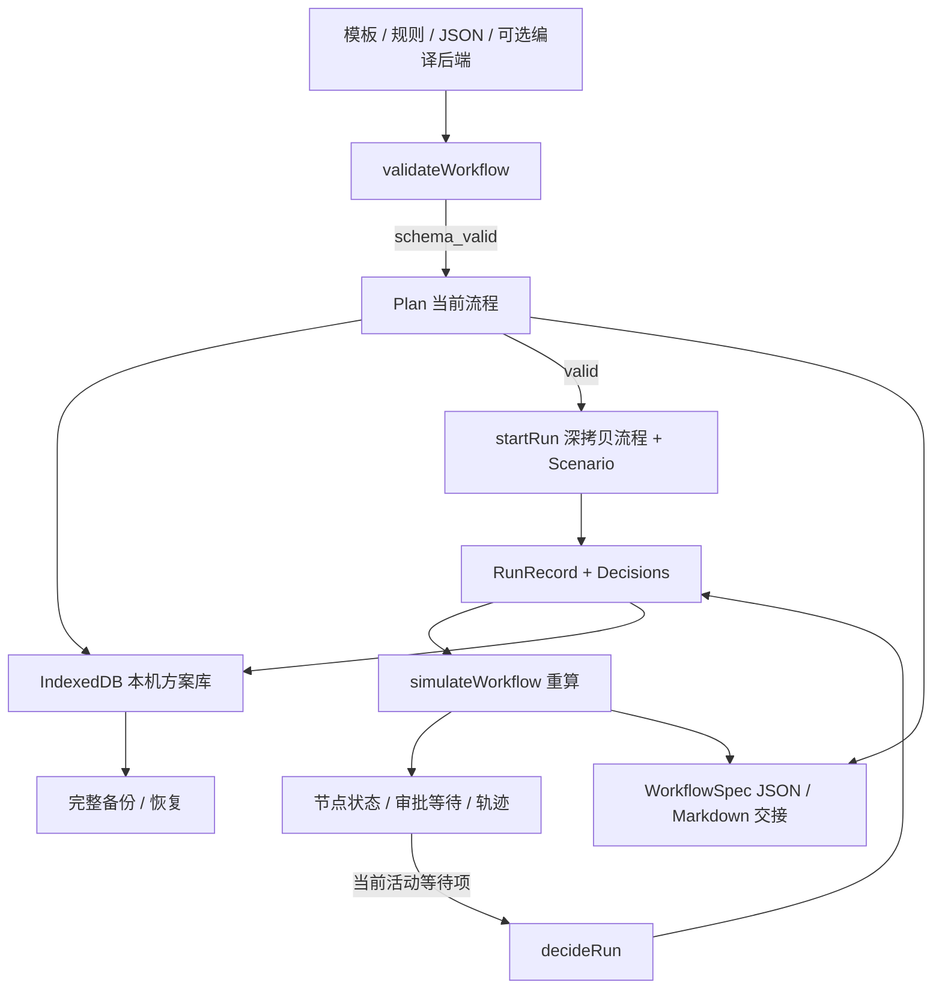

# FlowSpec 工作台架构

本文描述浏览器方案台的实现契约。原 Python 训练、模型服务和评测仍保留；它们与浏览器模拟状态机是不同执行路径，共享 WorkflowSpec 概念与工具目录，并不保证两个模拟器行为等价。

## 模块与数据流

| 模块 | 职责 |
|---|---|
| [App.tsx](../web/src/App.tsx) | 方案库、页面路由、活动方案、自动保存与错误恢复 |
| [PlanDialogs.tsx](../web/src/PlanDialogs.tsx) | 草案审阅、可选后端编译、JSON 导入与备份恢复 |
| [NodeEditor.tsx](../web/src/NodeEditor.tsx)、[WorkflowGraph.tsx](../web/src/WorkflowGraph.tsx) | 节点设置与依据真实依赖生成的图 |
| [PlanViews.tsx](../web/src/PlanViews.tsx) | 检查、模拟场景、审批、历史与导出 |
| [workflow-domain.ts](../web/src/workflow-domain.ts) | 类型、模板、有限规则编译、校验、纯浏览器模拟 |
| [workspace.ts](../web/src/workspace.ts) | 方案版本、运行快照、审批约束、备份验证与交接导出 |
| [workspace-store.ts](../web/src/workspace-store.ts) | IndexedDB 读写、事务完成确认与并发写入冲突检测 |
| [api.ts](../web/src/api.ts) | 自行运行时可选的 `/api/compile` 请求；不承担工作台试跑 |
| [Research.tsx](../web/src/Research.tsx) | 独立研究入口、原实验指标与资料链接 |



公开 Pages 构建设置 `VITE_STATIC_DEMO=true`，只开放浏览器规则草案。自行运行可选后端草案，向 `/api/compile` 发送需求并显示返回的编译器来源、修复记录；请求超时或失败不会替换已有方案。后端通过自己的验证后，结果还会经过浏览器检查；浏览器不会因后端返回成功而跳过自身门禁。

## 18 个工具的单一来源

权威注册表为 [src/flowspec/tools.py](../src/flowspec/tools.py) 中的 `TOOL_REGISTRY`。[export_tool_catalog.py](../scripts/export_tool_catalog.py) 对每项执行 `model_dump(mode="json")`，导出 [tool-catalog.json](../web/src/tool-catalog.json)；浏览器校验器和参数界面消费这份目录，不另维护一套工具名称和参数表。

目录保留全部 18 项工具的 `name`、`category`、中文 `description`、`risk` 和每个参数的 `type`、`required`、`description`。导出为 UTF-8，无时间戳，内容稳定。修改注册表后在仓库根目录执行：

```bash
uv run python scripts/export_tool_catalog.py
uv run python scripts/export_tool_catalog.py --check
```

`--check` 只读取并比较，缺失、不可读取或过期时返回非零，不改写文件。[目录测试](../tests/test_tool_catalog.py)检查完整注册表相等、字段保留、重复导出与 freshness 拒绝路径。

## 校验与编译边界

`validateWorkflow` 返回规范化后的 `workflow`、分层状态 `schema_valid` / `dag_valid` / `tools_valid`、总状态 `valid`、定位问题和拓扑顺序。缺省字段按契约补齐，未知字段作为结构错误，避免把无法理解的策略静默丢弃。

- **结构层**：WorkflowSpec 1.0、1–20 个节点、字段形状、编号、触发声明、重试范围和有限 JSON 参数。
- **依赖层**：重复、缺失、自依赖、循环，以及 `input_from` 是否指向真实祖先。
- **工具层**：工具与失败工具是否注册、参数是否必填/未知/类型正确、条件是否支持且具有上游风险节点、通知审批提示。

`createPlan`、`updatePlan` 和普通工作流导入以 `schema_valid` 为保存门槛，保留可编辑的语义或工具错误。`startRun` 要求总状态 `valid`。因此「保存成功」不等于「可以运行」，「检查通过」也不等于「业务需求完整」。

`compileInstruction` 是有限中文规则，不调用模型。它报告识别结果、默认假设和未处理要求；数据源、步骤顺序、部分否定与风险条件仅在已支持模式内识别，无法识别来源时不生成流程。它只会自动生成特定的情感/风险并行组合，不是通用自然语言编排器。

## 浏览器模拟契约

`simulateWorkflow(workflow, scenario, decisions)` 每次由输入重算，不执行工具适配器。`Scenario.risk` 为 `high` / `medium` / `low`；`failures` 将普通节点 ID 映射到 0–3 次首轮失败或 `always`。界面提供一个节点的故障注入，领域数据可表示多个；失败处理工具没有独立故障注入口。

模拟按拓扑顺序计算，各节点的关键规则如下：

1. 上游失败、拒绝或阻断使下游 `blocked`；上游待确认或未尝试使下游 `pending`。独立分支不受无关节点影响。
2. `when` 只接受一个比较式，例如 `risk == high` 或 `risk != low`；运算符为 `==` / `!=`，右值从 `high`、`medium`、`low` 中选一个，空格可变。它依赖成功的上游 `risk.classify` 输出，不进行任意表达式求值。条件为假则 `skipped`。
3. 跳过的控制依赖允许后续步骤继续；若 `input_from` 指向跳过节点，则缺少成功输出而阻断。多条控制依赖不等于多输入合并。
4. `requires_approval` 或目录风险为 `notify` / `approval` 的步骤必须有当前路径上的决定；没有决定为 `waiting_approval`，拒绝为 `rejected`，批准后才继续模拟。设置为无需审批也不能绕过通知门禁。
5. `retry.max_attempts` 为首次尝试之外的重试次数，0–3；总尝试上限为 `1 + max_attempts`。`backoff_seconds` 记录计划间隔，范围 0–300，不实际休眠。
6. 重试耗尽后才执行 `on_failure`。处理工具需要可用输入；通知/审批型处理工具使用独立决定键 `${nodeId}:failure`。完成处理后主节点仍为失败，依赖它的节点仍阻断。

| 节点状态 | 含义 |
|---|---|
| `pending` | 上游尚未确定，本节点未尝试 |
| `waiting_approval` | 当前步骤或其失败处理在等确认 |
| `succeeded` | 此模拟步骤完成，可能产生虚拟输出 |
| `skipped` | 风险条件不满足 |
| `rejected` | 当前审批被拒绝 |
| `failed` | 模拟失败并耗尽尝试，失败处理不会消除此状态 |
| `blocked` | 依赖或数据来源不可用 |

整体无效输入返回 `invalid`。存在等待项时整体优先为 `waiting_approval`，否则存在失败、阻断或拒绝则为 `failed`，其余为 `completed`。等待与独立失败可能同时存在，因此整体状态不能替代节点列表。

工具输出带模拟标识，来源为浏览器虚拟数据；风险使用情境值，其他检索、分类、文档等返回固定或占位内容。发送结果不代表真实发送。`cron` 和 `event` 只接受声明，不触发后台任务；独立分支也不代表真实并发性能。

## Plan、RunRecord 与版本

`Plan` 保存 `schemaVersion: 1`、独立 ID、标题、需求 `brief`、当前 `workflow`、来源 `origin` 与 `notes`、`revision`、创建/更新时间、`runs` 和 `activeRunId`。版本起于 R1。修改需求或流程增加版本并清除活动运行引用；改标题不增加版本。旧运行仍以深拷贝快照保留。

`RunRecord` 只保存 ID、开始时间、方案版本、工作流快照、场景与审批决定，不保存任意模拟输出。新运行插入列表首部，只保留最近 10 条，审批从空集合开始。`decideRun` 只接受当前版本、当前工作流活动运行中真正等待的审批或失败处理，不能预批后续节点、重用旧版本批准或改写已完成决定。

历史详情和交接文件调用当前版本的 `simulateWorkflow` 重算。记录没有模拟器版本或防篡改执行日志，因此未来算法变化可能改变历史显示；这是可复核的方案模拟记录，不是外部系统执行证明。

## 备份与独立副本

完整备份格式为 `{format: "flowspec-plan", schemaVersion: 1, plan: ...}`。`serializeBackup` 与 `validateBackup` 共用边界：单方案包装后最多 2,000,000 UTF-8 字节，嵌套深度 16，最多 100,000 个值；同时检查文本、ID、时间、版本、运行数量、工作流形状及场景引用。

未知字段、版本不兼容、非法当前活动记录和不可达审批会拒绝。审批验证从空决定开始反复模拟，只接受此时真实等待的决定，避免导入伪造的预审批。当前方案允许存在待修正工具/依赖问题，但保存下来的运行快照必须能完整通过运行校验。

`clonePlan(plan)` 创建新 ID、R1、无历史的副本；`clonePlan(plan, now, true)` 用于完整恢复，创建新方案 ID，同时保留原版本、运行快照、活动引用与决定。恢复与复制的语义不同，界面分别标明。

## IndexedDB 与保存可靠性

独立数据库 `flowspec-workspace` 的 `workspace` 对象仓库在键 `flowspec-workspace/v1` 保存 `{schemaVersion: 1, plans, selectedId, storageRevision}`。最多 30 个方案，选中 ID 必须存在，各方案通过完整备份验证。它按站点来源和浏览器配置文件隔离，没有账户和云同步。

`loadLibrary` 成功后才允许保存；异常数据或读取错误不会触发空库覆盖。写入进入队列，并在一个 `readwrite` 事务中读取持久化 `storageRevision`、比较当前页面预期版本、写入下一版本。事务完成后才更新内存中的预期值，配额错误或中止不显示成功。

另一标签页先提交时，旧页面得到 `StorageConflictError`，事务中止，不做最后写入者覆盖。界面保留未保存修改，提供备份、重试或重新载入。重新载入会丢弃该页面未保存的内存状态，应先备份。站点清理、浏览器私密模式、配额和关闭页面仍可能影响持久化；IndexedDB 不替代文件备份。

## 原 Python 路径与实验解释

[Python API](../src/flowspec/api.py)保留编译、验证和模拟接口，模型后端可配置为原启发式、Transformers/Adapter 或 llama.cpp 路径。它们服务研究与可选的本地草案生成。公开工作台不调用这些模型；本地选择后端时也只请求编译，之后在浏览器试跑。

[原模拟器](../src/flowspec/simulator.py)验证后遍历拓扑顺序，按 `approve_human_steps` 决定是否暂停在显式审批类别节点，其余节点产生成功轨迹。它不解释新版浏览器的条件、故障注入、重试或失败处理状态机，也不提供相同的逐通知审批行为。导出相同 WorkflowSpec 结构不意味着两个运行器语义相同。

[实验汇总](../reports/experiment-summary.md)、[模型卡](../MODEL_CARD.md)、[数据卡](../DATA_CARD.md)和[错误分析](error-analysis.md)保留原研究数值及 provisional 限定。旧 Python 沙箱通过率不能作为新版状态机验收结果，也没有形成用户效率或真实业务执行效果的证据。

## 验证入口

```bash
# 仓库根目录：目录来源与 Python 研究检查
uv run python scripts/export_tool_catalog.py --check
uv run pytest -q
uv run ruff check .

# 浏览器领域、备份和事务测试；Node 22
cd web
npm ci
npm test
npm run build
```

[工作流领域测试](../web/tests/workflow-domain.test.mjs)覆盖校验、规则编译和状态流转；[工作区测试](../web/tests/workspace.test.mjs)覆盖版本、快照隔离、恢复审批、备份边界和事务冲突/中止。存储测试使用测试替身，不能代替具体浏览器的存储配额和生命周期验证。使用操作见[产品说明](product-workbench.md)。
