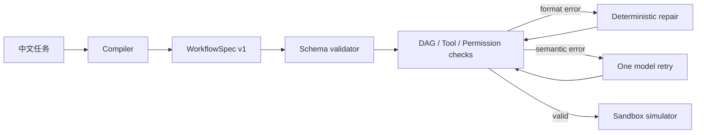

# 架构说明

```mermaid
flowchart LR
  A[中文任务] --> B[Compiler]
  B --> C[WorkflowSpec v1]
  C --> D[Schema validator]
  D --> E[DAG / Tool / Permission checks]
  E -->|format error| F[Deterministic repair]
  E -->|semantic error| G[One model retry]
  E -->|valid| H[Sandbox simulator]
  F --> E
  G --> E
```

模型只负责从语言到候选结构；确定性规则负责可执行性边界。首版不会连接真实外部写操作。
